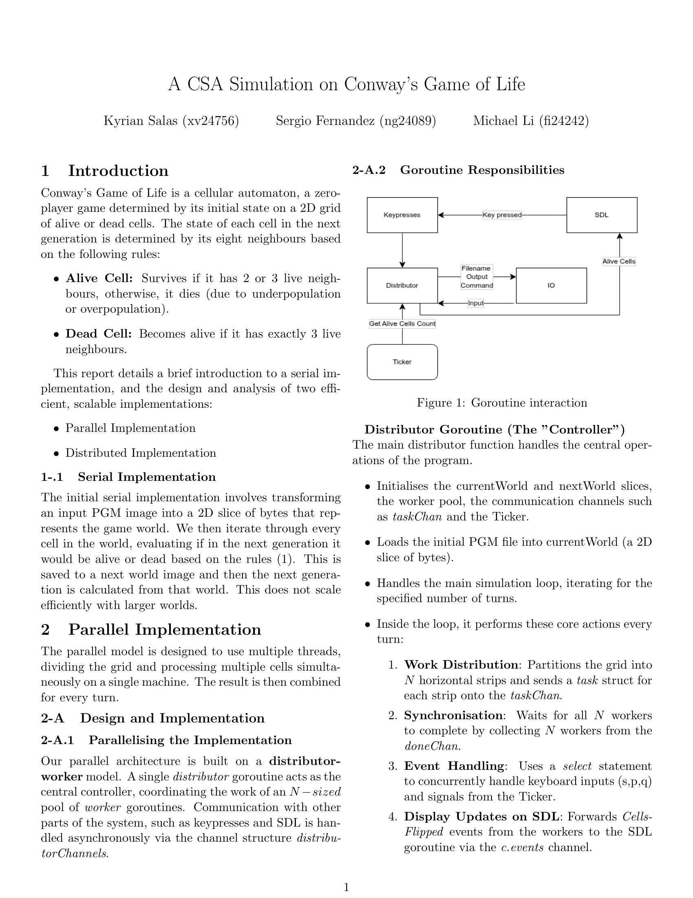
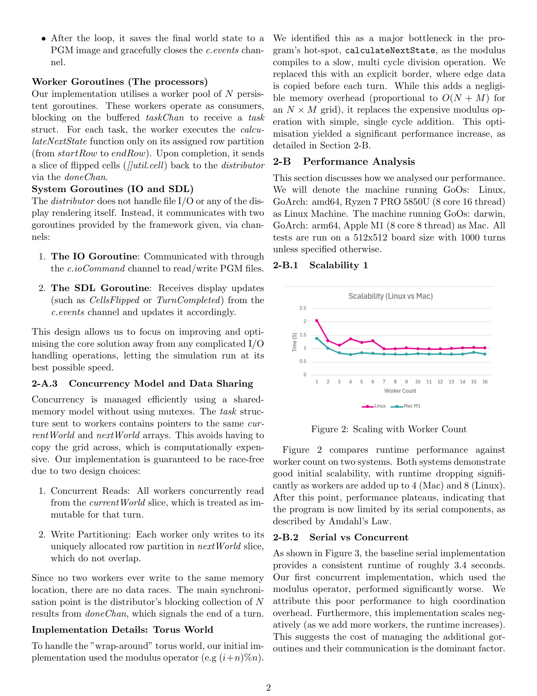
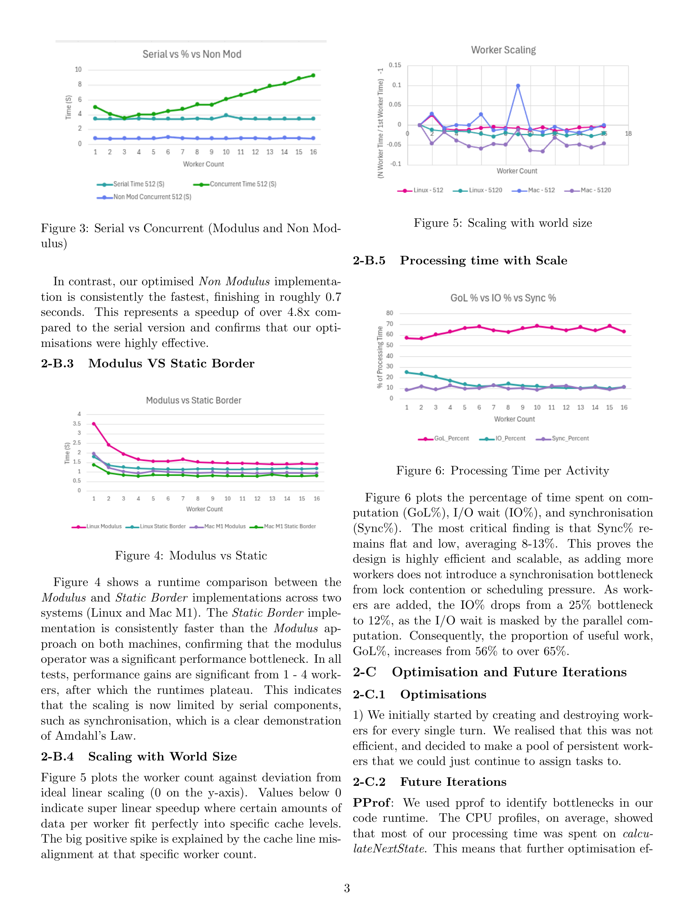
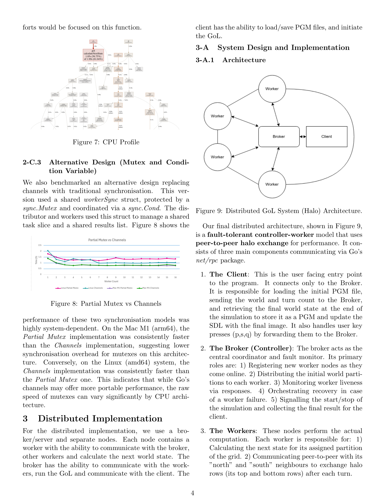
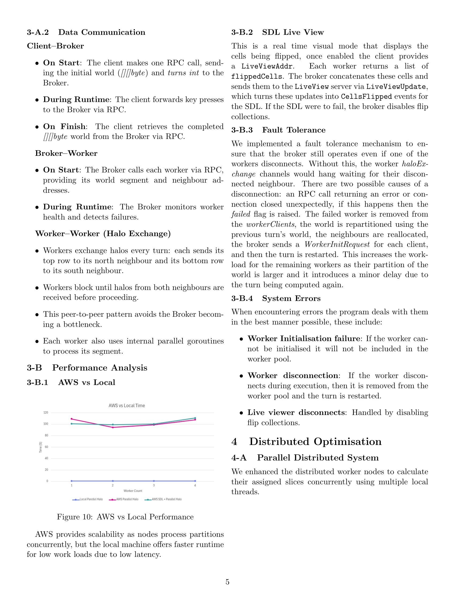
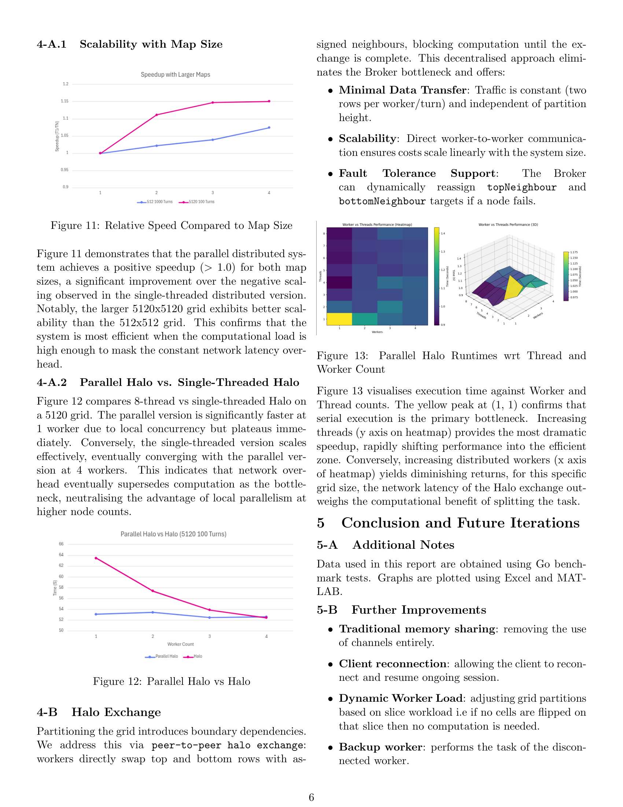

# Conway's Game of Life (Go)

A high-performance implementation of **Conway's Game of Life**, developed as part of the Computer Science curriculum at the **University of Bristol**. This project demonstrates the progression from a basic sequential model to a highly parallelised, distributed system leveraging Go's concurrency primitives.

## Overview
The simulation is implemented across two major development phases, focusing on scalability, synchronisation, and network communication.

---

## Project Phases

### Part 1: Concurrent Simulation
The first phase focuses on the transition from a single-threaded approach to a multi-threaded model to maximise local CPU utilisation.

* **Sequential Logic:** A baseline implementation establishing a performance benchmark by processing grid transitions in a single thread.
* **Worker Pattern:** Utilises worker **goroutines** to divide the grid into slices, processing generations in parallel.
* **Synchronisation:** Employs **Go channels** to ensure all workers complete a generation before the "double-buffer" grid is swapped, preventing race conditions.

### Part 2: Distributed System
The second phase scales the simulation across a network, allowing it to handle massive grids by distributing the workload to multiple physical or virtual nodes.

* **Master-Worker Architecture:** A central controller partitions the game board and orchestrates tasks across a cluster of worker nodes.
* **NetRPC Communication:** Leverages Go’s `net/rpc` standard library to facilitate Remote Procedure Calls for efficient data exchange between nodes.
* **AWS Deployment:** Designed to be deployed on an **AWS EC2** cluster, demonstrating cloud-scale processing and fault-tolerant network logic.

---

## Key Technical Concepts

* **Concurrency:** Heavy use of Goroutines and Channels for thread-safe processing.
* **Distributed Computing:** Implementation of the NetRPC protocol for inter-node communication.
* **Cloud Infrastructure:** Experience with AWS EC2 orchestration.
* **Algorithms:** Optimised 2D grid manipulation and neighbour-sensing logic.

---

## Report

